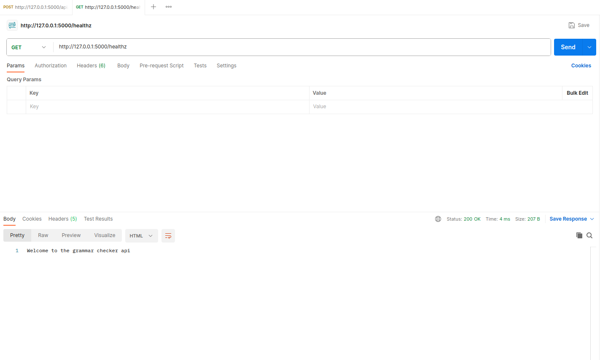
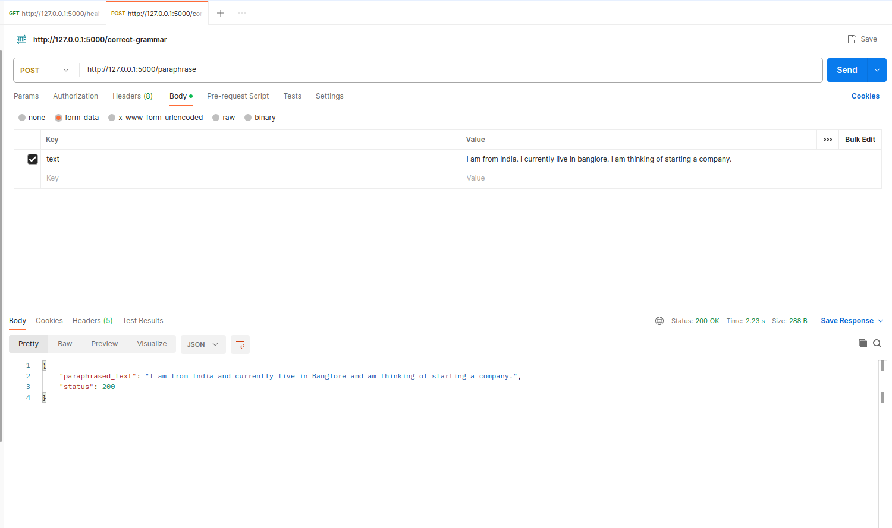
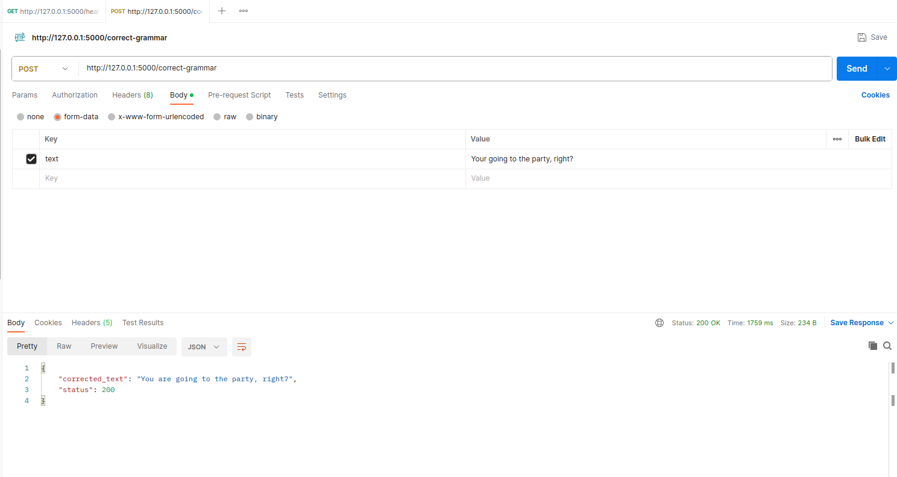

# Paraphrase api

## Installation

1. Make sure you have Python 3.x installed on your system.
2. Clone this repository
3. Change into project directory: ```cd <project_directory>```
4. Create a virtualenv (optional but recommended): ```python3 -m venv venv```
5. Activate the virtualenv
    On macOS and Linux:
    ```source venv/bin/activate```
    On Windows (PowerShell):
    ```.\venv\Scripts\Activate```
6. Install the required packages from the requirements.txt file:
    ```pip install -r requirements.txt```


## Running the flask app
```flask run```

## Api endpoints
### Health Check

    Endpoint: http://127.0.0.1:5000/healthz
    Method: GET
    Description: Use this endpoint to check the health of the application.

Example api call:


### Paraphrasing endpoint

    Endpoint: http://127.0.0.1:5000/paraphrase
    Method: POST
    Description: Use this endpoint to send text data for paraphrasing.

Example api call:

Response
1. For successfull prediction (Text passed in formdata)
``` bash
{
    "paraphrased_text": "I am from India and currently live in Banglore and am thinking of starting a company.",
    "status": 200
}
```
2. If text not passed in formdata:
```bash
{
    "error_message": "No text in form_data",
    "status": 400
}
```

### Grammar correction endpoint

    Endpoint: http://127.0.0.1:5000/correct-grammar
    Method: POST
    Description: Use this endpoint to send text data for grammar correction.

Example api call:


Response
1. For successfull prediction (Text passed in formdata)
``` bash
{
    "corrected_text": "You are going to the party, right?",
    "status": 200
}
```
2. If text not passed in formdata:
```bash
{
    "error_message": "No text in form_data",
    "status": 400
}
```